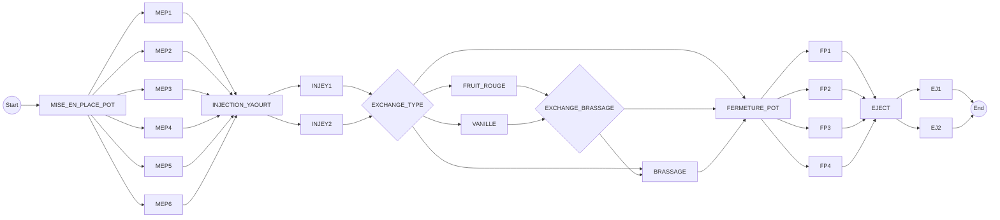

# Digital Twin IF 2024

## Introduction

The project's goal is to create a digital twin simulation tool that must find the best manufacturing order based on :

- **TYPES** : In the `types.xml` file you have defined all manufacturable types. Each type are defined withing a root XML node named `types` and contains a list of `type` XML objects.

  For each `type` you have the a mandatory `id` property and production steps that are also mandatory. In order to be processed correctly, all production steps needs to be defined in the right order (production order) !

```
<!-- The "time_s" property is defined in seconds -->
    <type id="nature" name="Yaourt Nature">
        <steps>
            <step id="MISE_EN_PLACE_POT" description="Mise en place du pot" time_s="5"/>
            <step id="INJECTION_YAOURT" description="Injection du yaourt" time_s="3"/>
            <step id="FERMETURE_POT" description="Fermeture du port" time_s="5"/>
            <step id="EJECT" description="Ejection" time_s="5"/>
        </steps>
    </type>
```

- **WORKLOAD** : Defined in the `input.xml` file, you have an _UNSORTED_ list of item to manufacture. Items are inserted by object type and have the a `qt` property defined to set the quantity to manufacture.

- **TOPOLOGY** : Defined in the `topology.xml` file, you have the architecture of the manufacturing line within the factory. A `topology.xml` file is provided in this repository that can be translated as such :



## Processing

You need to produce a `C#` program that will take the `input.xml`, `types.xml` and `topology.xml` to produce an `ouput.xml` containing the right and most optimized manufacturing order.

```
<!-- Example of an output.xml file -->
<list>
    <fruit_rouge_brass/>
    <vanilla/>
    <nature/>
    <nature/>
    <vanilla_brass/>
    <fruit_rouge_brass/>
    <vanilla_brass/>
    <vanilla_brass/>
    <vanilla_brass/>
    <vanilla_brass/>
    <nature/>
    <fruit_rouge_brass/>
    <fruit_rouge_brass/>
</list>
```

Your application will need to take all of those file as arguments such as :

`./manufacturing_sort.exe --input "input.xml" --topology "topology.xml" --types "types.xml" --ouput "output.xml"`

## Evaluation

At the end of the project, your program will be benchmarked against other groups.

- You will need to produce a full fledge PowerPoint presentation explaining how your algo works with exemples.
  - If presented in the most pedagogic ways (with annimations etc.) it will be rewarded.
  - The quality of the presentation and the _attitude_ counts.
- Best result against other groups will give extra points.
- Your program should NEVER crash.
- Always produce a valid XML.
